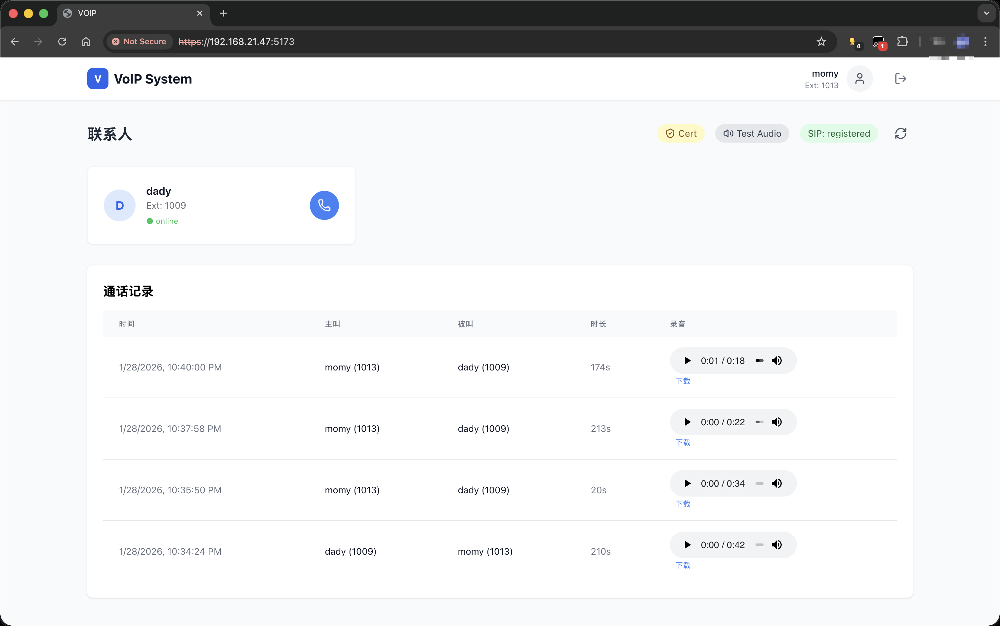

# FreeSWITCH Local Network VoIP System

[English](./README_EN.md) | 简体中文

基于 FreeSWITCH 的局域网 VoIP 通信系统，支持点对点语音通话、通话录音。

## 技术栈

| 层级 | 技术 |
|------|------|
| 前端 | React 18 + TypeScript + Vite + TailwindCSS |
| 后端 | Node.js + Express + TypeScript |
| 数据库 | PostgreSQL + Prisma ORM |
| 通信 | FreeSWITCH + ESL (Event Socket Library) |
| 容器化 | Docker + Docker Compose |
| SIP 客户端 | SIP.js (WebRTC) |

## 演示

<table>
  <tr>
    <th width="33%">完整演示</th>
    <th width="33%">快速预览</th>
    <th width="33%">系统截图</th>
  </tr>
  <tr>
    <td>
      <video src="./demo/freeswitch-localnetwork-demo.mp4" controls width="100%"></video>
    </td>
    <td>
      <video src="./demo/freeswitch-localnetwork-demo-zip.mp4" controls width="100%"></video>
    </td>
    <td>
      
    </td>
  </tr>
</table>

## 前置要求

在启动项目之前，请确保已安装以下工具：

```bash
# 检查安装版本
node --version      # >= 18.x
npm --version       # >= 9.x
docker --version    # >= 20.x
docker-compose --version
```


2. 使用 `npm run update-ip` 更新配置中的本地 IP


## 快速开始

### 1. 克隆项目

```bash
git clone <repository-url>
cd freeswitch-local-network
```

### 2. 安装依赖

```bash
npm install
```

### 3. 更新局域网 IP 地址

**重要**: 首次启动或更换网络环境时，必须更新配置中的 IP 地址。

```bash
# 自动检测并更新本机局域网 IP（推荐）
npm run update-ip

# 或者手动指定 IP
node scripts/update-ip.js 192.168.1.100

# 预览模式（查看将要更新的内容，不实际修改）
npm run update-ip:dry
```

该脚本会自动更新以下配置文件中的 IP 地址：
- `freeswitch/conf/vars.xml` - FreeSWITCH 全局变量
- `freeswitch/conf/sip_profiles/internal.xml` - SIP 配置文件
- `freeswitch/conf/directory/default.xml` - 用户目录配置
- `src/store/useCallStore.ts` - 前端 SIP 域名配置
- `nginx_proxy/nginx.conf` - Nginx 代理配置

### 4. 启动 Docker 服务

启动 PostgreSQL、FreeSWITCH 和 Nginx 服务：

```bash
docker-compose up -d
```

验证服务状态：

```bash
docker-compose ps
```

### 5. 初始化数据库

```bash
# 生成 Prisma Client
npx prisma generate

# 推送数据库 Schema
npx prisma db push
```

### 6. 启动开发服务器

```bash
# 同时启动前端和后端
npm run dev
```

或者分别启动：

```bash
# 仅启动前端 (Vite 开发服务器)
npm run client:dev

# 仅启动后端 (Express + Nodemon)
npm run server:dev
```

### 7. 访问应用并开始使用

- **前端界面**: https://<your-localip>>:5173
- **API 服务**: https://<your-localip>>:3001
- **FreeSWITCH ESL**:https://<your-localip>>:8021
- **Nginx 代理**: https://<your-localip>>:8443

#### 7.1 SIP 注册

打开应用后，输入用户名

【重要】点击 cert 按钮，接受证书，以支持 sip 连接

1. 注册成功后，顶部状态栏会显示在线状态（registered）


#### 7.2 接受 FreeSWITCH 证书

**首次使用必须**: 局域网环境需要接受 FreeSWITCH 的自签名证书才能建立加密 SIP 连接（WSS）。

1. 点击顶部导航栏的 **"Cert"** 按钮（黄色盾牌图标）
2. 在新打开的标签页中，浏览器会提示证书不受信任
3. 点击 **"高级"** → **"接受风险并继续"**
4. 证书接受后，关闭该标签页返回应用

> **为什么需要这一步？**
>
> FreeSWITCH 使用自签名证书提供 WSS (WebSocket Secure) 服务。浏览器默认会阻止此类连接，需要用户手动信任该证书后，SIP.js 才能通过 `wss://<IP>:8443` 建立安全连接。

## 服务端口说明

| 服务 | 端口 | 协议 | 说明 |
|------|------|------|------|
| 前端开发服务器 | 5173 | HTTP | Vite HMR |
| 后端 API 服务 | 3001 | HTTP | Express REST API |
| PostgreSQL | 5432 | TCP | 数据库 |
| FreeSWITCH SIP | 5060/5080 | UDP/TCP | SIP 信令 |
| FreeSWITCH ESL | 8021 | TCP | 事件 Socket |
| FreeSWITCH WebSocket | 5066 | TCP | WS/WSS SIP |
| RTP 媒体流 | 16384-16400 | UDP | 音频媒体 |
| Nginx 代理 | 8443 | HTTPS | 反向代理 |

## 可用命令

```bash
# 开发
npm run client:dev      # 启动前端开发服务器
npm run server:dev      # 启动后端开发服务器
npm run dev             # 同时启动前后端

# 构建
npm run build           # 构建生产版本
npm run preview         # 预览生产构建

# 代码检查
npm run lint            # ESLint 检查
npm run check           # TypeScript 类型检查

# 数据库
npm run prisma:studio   # 打开 Prisma Studio

# 工具
npm run update-ip       # 更新配置中的 IP 地址
npm run update-ip:dry   # 预览 IP 更新（不写入）
```

## 项目结构

```
freeswitch-local-network/
├── api/                    # 后端代码
│   ├── lib/               # ESL 连接库
│   ├── routes/            # API 路由
│   └── server.ts          # 后端入口
├── src/                    # 前端代码
│   ├── components/        # React 组件
│   ├── pages/             # 页面组件
│   └── store/             # Zustand 状态管理
├── freeswitch/            # FreeSWITCH 配置
│   └── conf/              # 配置文件目录
├── nginx_proxy/           # Nginx 配置
├── scripts/               # 工具脚本
├── docker-compose.yml     # Docker 服务编排
└── package.json           # 项目配置
```

## 常见问题

### FreeSWITCH 连接失败

确保 Docker 服务正常运行：

```bash
docker-compose logs freeswitch
```

### 数据库连接错误

检查 PostgreSQL 容器状态：

```bash
docker-compose ps postgres
```

### SIP 注册失败

**症状**: 登录后无法注册到 FreeSWITCH 服务器，状态栏显示离线

**排查步骤**:

1. **检查网络连接**
   ```bash
   # 测试 FreeSWITCH 服务是否可访问
   curl https://<你的局域网IP>:8443
   ```

2. **更新局域网 IP 配置**
   ```bash
   # 自动检测并更新本机 IP
   npm run update-ip

   # 或者手动指定 IP
   node scripts/update-ip.js 192.168.1.100

   # 预览将要更改的内容（不实际修改）
   npm run update-ip:dry
   ```

3. **验证 FreeSWITCH 配置**
   ```bash
   # 查看 FreeSWITCH SIP 配置
   docker-compose exec freeswitch fs_cli -x "sofia status profile internal"

   # 查看当前 Ext-RTP-IP 和 Ext-SIP-IP 是否正确
   ```

4. **检查用户分机是否存在**
   ```bash
   # 查看所有分机列表
   docker-compose exec freeswitch fs_cli -x "user_list"
   ```

## License

MIT
